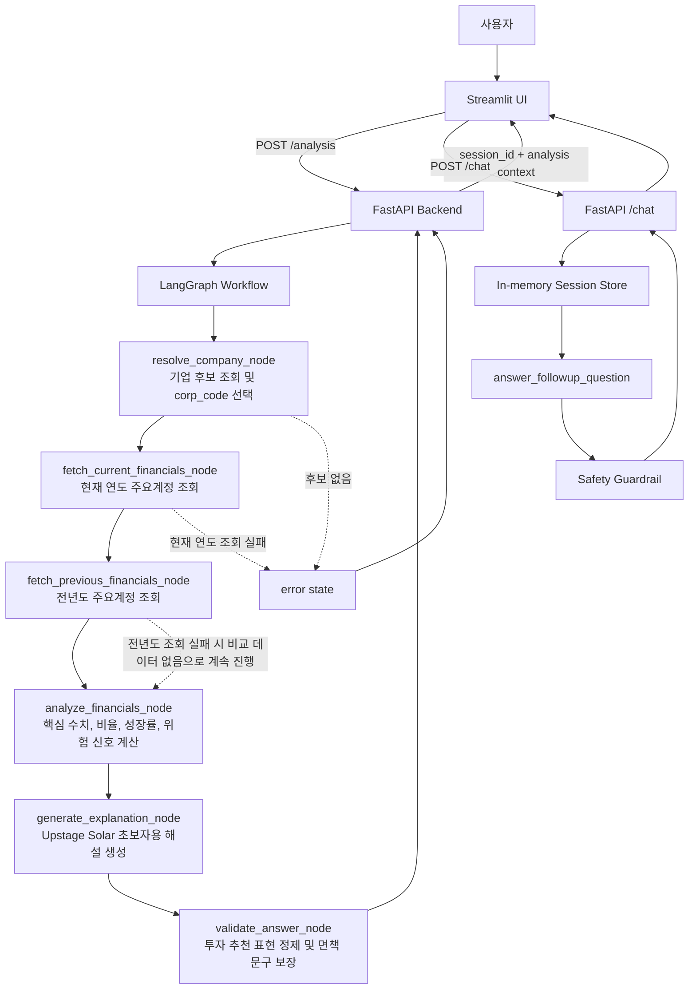

# 공시톡: DART 재무제표 분석 챗봇

공시톡은 사용자가 기업명, 사업연도, 보고서 종류를 입력하면 OpenDART 공시 데이터를 기반으로 핵심 재무 수치와 재무비율을 분석하고, 초보자도 이해하기 쉬운 재무제표 해설을 제공하는 웹 애플리케이션이다.

본 서비스는 투자 추천 도구가 아니라 공시 기반 재무정보 해설 도구이다. 매수, 매도, 종목 추천, 목표주가, 수익률 예측은 제공하지 않는다.

## 1. 프로젝트 개요

공시톡은 기업 공시를 직접 읽기 어려운 사용자를 위해 다음 과정을 자동화한다.

- 기업명으로 OpenDART 기업 고유번호 조회
- 단일회사 주요계정 재무제표 조회
- 매출, 영업이익, 당기순이익, 자산총계, 부채총계, 자본총계 추출
- 영업이익률, 순이익률, ROE, 부채비율, 자기자본비율 계산
- 전년도 수치와 비교한 성장률 계산
- 위험 신호 탐지
- Upstage Solar 모델을 활용한 초보자용 재무제표 해설 생성
- 저장된 분석 결과 기반 추가 질문 답변

현재 구조는 Streamlit 프론트엔드와 FastAPI 백엔드를 분리한 형태이다. Streamlit은 입력, 결과 화면, 채팅 UI를 담당하고 FastAPI는 DART API 호출, 데이터 정제, LangGraph workflow 실행, LLM 해설 생성을 담당한다.

## 2. 문제 정의

기업 공시는 신뢰도 높은 공식 데이터이지만 초보 사용자가 바로 이해하기 어렵다.

- 기업명만으로 DART 기업 고유번호를 찾기 어렵다.
- 재무제표 계정명이 기업별로 달라 핵심 수치를 직접 추출하기 어렵다.
- 재무비율 계산 방식과 의미를 모르면 숫자를 해석하기 어렵다.
- AI 해설이 투자 추천처럼 보이면 사용자에게 잘못된 의사결정 신호를 줄 수 있다.

공시톡은 공시 데이터 기반 해설, 계산 과정 자동화, 금융 안전장치를 함께 제공하여 위 문제를 완화한다.

## 3. 핵심 기능

- **분석 조건 입력**: 기업명, 사업연도, 보고서 종류를 Streamlit 사이드바 form으로 입력한다.
- **기업 고유번호 조회**: OpenDART `corpCode.xml`을 ZIP/XML로 파싱하고 `data/corp_codes.csv`에 캐싱한다.
- **주요계정 조회**: OpenDART `fnlttSinglAcnt.json`으로 단일회사 주요계정 데이터를 조회한다.
- **핵심 수치 추출**: CFS 연결재무제표를 우선 사용하고 없으면 OFS 개별재무제표를 사용한다.
- **재무비율 계산**: 수익성, 안정성, 자본구조 관련 주요 비율을 계산한다.
- **전년 대비 비교**: 현재 연도와 전년도 재무 수치를 비교하고 성장률을 계산한다.
- **시각화**: 핵심 재무 수치와 전년도 비교를 `st.bar_chart`로 표시한다.
- **AI 해설**: Upstage Solar 모델을 OpenAI-compatible SDK로 호출해 초보자용 해설을 생성한다.
- **추가 질문 채팅**: 분석된 재무 데이터 안에서만 답변하는 ChatGPT형 UI를 제공한다.
- **인메모리 세션 기록**: FastAPI 서버 메모리에 분석 세션과 채팅 기록을 유지한다.
- **금융 안전장치**: 투자 추천 요청 탐지, 답변 정제, 면책 문구 추가를 수행한다.

## 4. 시스템 아키텍처

```text
사용자
  ↓
Streamlit UI (app.py)
  ├─ 분석 조건 form
  ├─ 결과 대시보드
  ├─ ChatGPT형 추가 질문 UI
  ├─ 최근 대화 세션 목록
  └─ 분석 진행 패널
  ↓ HTTP
FastAPI Backend (backend/main.py)
  ├─ LangGraph Workflow (src/workflow.py)
  ├─ OpenDART Client (src/dart_client.py)
  ├─ Financial Analyzer (src/financial_analyzer.py)
  ├─ Upstage LLM Client (src/llm_client.py)
  ├─ Safety Guardrail (src/safety.py)
  └─ In-memory Session Store (backend/session_store.py)
```

## 5. AI Workflow 상세 설명

공시톡의 분석 로직은 `src/workflow.py`의 LangGraph workflow로 분리되어 있다. 각 node는 독립 함수이므로 테스트가 가능하며, FastAPI는 workflow를 호출한 뒤 Streamlit이 사용할 응답 형태로 변환한다.

### Workflow State

`FinancialWorkflowState`는 workflow 전체에서 공유되는 상태이다.

| 필드 | 의미 |
| --- | --- |
| `company_name` | 사용자가 입력한 기업명 |
| `year` | 사업연도 |
| `report_code` | DART 보고서 코드 |
| `report_name` | 화면 표시용 보고서 이름 |
| `corp_code` | DART 기업 고유번호 |
| `selected_company` | 최종 선택된 기업 정보 |
| `candidate_companies` | 기업명 검색 후보 목록 |
| `current_df` | 현재 연도 주요계정 DataFrame |
| `previous_df` | 전년도 주요계정 DataFrame |
| `numbers` | 핵심 재무 수치 |
| `previous_numbers` | 전년도 핵심 재무 수치 |
| `ratios` | 재무비율 |
| `growth` | 전년 대비 증가율 |
| `risk_signals` | 추가 확인이 필요한 신호 |
| `explanation` | AI 해설 |
| `error` | workflow 중단 사유 |

### Node 구성

1. **resolve_company_node**
   - `find_corp_candidates(company_name)`로 기업 후보를 찾는다.
   - 후보가 없으면 `error`를 설정한다.
   - 상장회사(`stock_code` 존재)를 우선 정렬한 후보 중 첫 번째를 선택한다.
   - 선택 기업과 후보 목록을 state에 저장한다.

2. **fetch_current_financials_node**
   - 선택된 `corp_code`, `year`, `report_code`로 현재 연도 주요계정을 조회한다.
   - 현재 연도 데이터 조회 실패는 핵심 분석 실패이므로 `error`를 설정한다.

3. **fetch_previous_financials_node**
   - `year - 1` 기준으로 전년도 주요계정을 조회한다.
   - 전년도 데이터는 비교용 부가 데이터이므로 실패해도 workflow를 중단하지 않는다.
   - 실패 시 `previous_df=None`, `previous_numbers=None`, `growth={}`로 진행한다.

4. **analyze_financials_node**
   - 현재 연도 DataFrame에서 핵심 수치를 추출한다.
   - 재무비율을 계산한다.
   - 전년도 데이터가 있으면 전년도 핵심 수치와 성장률을 계산한다.
   - 위험 신호를 탐지한다.

5. **generate_explanation_node**
   - 회사명, 연도, 보고서 종류, 수치, 비율, 성장률, 위험 신호를 LLM에 전달한다.
   - Upstage API 키가 없으면 LLM을 호출하지 않고 안내 메시지를 반환한다.
   - 투자 추천, 목표주가, 수익률 예측을 금지하는 system prompt를 사용한다.

6. **validate_answer_node**
   - LLM 답변을 안전장치에 다시 통과시킨다.
   - 매수/매도 추천으로 오해될 수 있는 문장을 완화한다.
   - 면책 문구를 보장한다.

### Mermaid Diagram



## 6. Streamlit UI 흐름

Streamlit UI는 사용자 경험을 위해 다음 방식으로 구성했다.

- 분석 조건 입력은 `st.form`으로 묶어 입력값 변경 중 불필요한 화면 깜빡임을 줄인다.
- `분석하기`를 누르면 프론트에서 임시 분석 세션을 먼저 만들고 최근 대화 목록에 `분석 중` 상태로 표시한다.
- 분석 진행 패널은 제목 바로 아래 본문 흐름에 표시된다.
- 분석 완료 후 실제 백엔드 `session_id`로 교체하고 결과 대시보드를 렌더링한다.
- 최근 대화 목록에서 이전 분석 세션을 선택하면 캐시된 세션은 즉시 복원하고, 처음 여는 세션만 백엔드에서 상세 조회한다.
- 추가 질문 영역은 사용자 말풍선 우측 정렬, AI 답변 좌측 정렬로 ChatGPT형 UI를 따른다.

## 7. FastAPI API

| Method | Path | 설명 |
| --- | --- | --- |
| `GET` | `/health` | 백엔드 상태 확인 |
| `POST` | `/analysis` | 재무 분석 workflow 실행 |
| `POST` | `/chat` | 저장된 분석 결과 기반 추가 질문 답변 |
| `GET` | `/sessions` | 인메모리 세션 목록 조회 |
| `GET` | `/sessions/{session_id}` | 특정 세션의 분석 결과와 채팅 기록 조회 |

`POST /analysis` 요청 예시:

```json
{
  "company_name": "삼성전자",
  "year": 2024,
  "report_code": "11011",
  "report_name": "사업보고서"
}
```

분석 완료 후 백엔드는 `session_id`, 기업 정보, 핵심 수치, 전년도 비교, 비율, 위험 신호, 원본 주요계정 일부, AI 해설을 반환한다.

## 8. OpenDART API 활용 방식

### 기업 고유번호 조회

- API: `corpCode.xml`
- 응답 형식: ZIP binary
- 처리 방식:
  - ZIP 압축 해제
  - XML 파싱
  - `corp_code`, `corp_name`, `corp_eng_name`, `stock_code`, `modify_date`를 DataFrame으로 변환
  - `data/corp_codes.csv`에 캐싱
  - 캐시가 있으면 API를 다시 호출하지 않음

### 단일회사 주요계정 조회

- API: `fnlttSinglAcnt.json`
- 요청 파라미터:
  - `crtfc_key`
  - `corp_code`
  - `bsns_year`
  - `reprt_code`
- DART 응답 `status`가 `"000"`이 아니면 `DartApiError`를 발생시킨다.
- 응답 `list`를 pandas DataFrame으로 변환한다.

보고서 코드:

| 보고서 종류 | 코드 |
| --- | --- |
| 사업보고서 | `11011` |
| 반기 | `11012` |
| 1분기 | `11013` |
| 3분기 | `11014` |

## 9. 재무 수치 및 비율 계산

추출하는 핵심 수치:

- 매출액
- 영업이익
- 당기순이익
- 자산총계
- 부채총계
- 자본총계

계정명 후보는 기업별 차이를 고려해 여러 후보명을 둔다. `fs_div`가 `CFS`인 연결재무제표를 우선 사용하고, 없으면 `OFS` 개별재무제표를 사용한다.

계산 비율:

| 지표 | 계산식 |
| --- | --- |
| 영업이익률 | 영업이익 / 매출액 |
| 순이익률 | 당기순이익 / 매출액 |
| ROE | 당기순이익 / 자본총계 |
| 부채비율 | 부채총계 / 자본총계 |
| 자기자본비율 | 자본총계 / 자산총계 |
| 전년 대비 증가율 | `(현재 연도 값 - 전년도 값) / 전년도 값` |

분모가 없거나 0이면 무리하게 계산하지 않고 `데이터 없음` 또는 `추가 확인 필요`로 표시한다.

위험 신호 예시:

- 부채비율 200% 초과
- 영업이익률 음수
- 순이익률 음수
- 자본총계 0 이하 또는 없음
- 매출액 없음 또는 0

## 10. LLM 및 안전장치

LLM은 Upstage Solar를 OpenAI-compatible SDK 방식으로 호출한다.

환경변수:

- `UPSTAGE_API_KEY`
- `UPSTAGE_BASE_URL`
- `UPSTAGE_MODEL`

프롬프트 원칙:

- 제공된 숫자와 계산 결과만 사용한다.
- 숫자가 없는 항목은 추측하지 않는다.
- 초보자도 이해할 수 있게 설명한다.
- 매수/매도 의견, 투자 추천, 목표주가, 수익률 예측은 하지 않는다.

안전장치:

- `detect_investment_advice_request(text)`로 투자 추천성 질문을 탐지한다.
- `sanitize_financial_answer(answer)`로 매수/매도 추천으로 오해될 수 있는 문장을 완화한다.
- follow-up 질문이 투자 추천이면 직접 답하지 않고 재무제표에서 확인할 지표를 안내한다.
- 모든 해설에는 면책 문구를 포함한다.

면책 문구:

> 본 서비스는 투자 추천이 아닌 공시 기반 재무정보 해설 도구입니다.

## 11. 추가 질문 및 세션 기록

분석 완료 후 사용자는 추가 질문을 입력할 수 있다.

예시 질문:

- 이 회사 부채가 많은 편이야?
- 돈을 잘 벌고 있는 회사야?
- 위험 신호만 쉽게 설명해줘.
- 초보자가 봐야 할 지표 3개만 알려줘.
- 전년 대비 좋아진 점과 추가 확인할 점을 알려줘.

세션 기록은 FastAPI 백엔드의 인메모리 저장소에 유지된다. 서버가 실행 중인 동안에는 최근 대화 목록에서 이전 분석으로 돌아갈 수 있지만, 백엔드를 재시작하면 기록은 사라진다.

## 12. 프로젝트 구조

```text
gongsitalk/
├── app.py
├── backend/
│   ├── __init__.py
│   ├── main.py
│   ├── schemas.py
│   └── session_store.py
├── src/
│   ├── __init__.py
│   ├── dart_client.py
│   ├── financial_analyzer.py
│   ├── llm_client.py
│   ├── safety.py
│   ├── utils.py
│   └── workflow.py
├── tests/
│   ├── test_backend.py
│   ├── test_dart_client.py
│   ├── test_financial_analyzer.py
│   ├── test_llm_client.py
│   ├── test_safety.py
│   ├── test_utils.py
│   └── test_workflow.py
├── requirements.txt
├── .env.example
├── .gitignore
├── README.md
└── PLANNING_REPORT.md
```

## 13. 실행 방법

가상환경 생성 및 패키지 설치:

```bash
python -m venv .venv
pip install -r requirements.txt
```

Windows PowerShell:

```powershell
python -m venv .venv
.\.venv\Scripts\Activate.ps1
pip install -r requirements.txt
```

FastAPI 백엔드 실행:

```bash
uvicorn backend.main:app --reload --port 8000
```

Streamlit UI 실행:

```bash
streamlit run app.py
```

기본 접속 주소:

- Streamlit: `http://localhost:8501`
- FastAPI: `http://localhost:8000`

테스트 실행:

```bash
pytest
```

## 14. 환경변수 설정

프로젝트 루트에 `.env` 파일을 만들고 다음 값을 설정한다.

```env
DART_API_KEY=your_opendart_api_key_here
UPSTAGE_API_KEY=your_upstage_api_key_here
UPSTAGE_BASE_URL=https://api.upstage.ai/v1
UPSTAGE_MODEL=solar-pro3
GONGSITALK_BACKEND_URL=http://localhost:8000
```

- `.env`는 `.gitignore`에 포함되어야 한다.
- API 키는 코드에 하드코딩하지 않는다.

## 15. 테스트 범위

현재 테스트는 다음 영역을 다룬다.

- DART 기업코드 XML/ZIP 파싱
- DART 주요계정 API 성공/오류 mock
- 핵심 재무 수치 추출
- 재무비율 및 성장률 계산
- 위험 신호 탐지
- LLM 호출 mock
- 투자 추천 안전장치
- LangGraph workflow node
- FastAPI analysis/chat/session endpoint

## 16. 한계점

- OpenDART 주요계정 API의 계정명은 기업별로 달라 모든 기업의 수치 추출을 완벽히 보장하지 않는다.
- 전년도 데이터가 없거나 보고서 종류가 다르면 성장률 비교가 제한된다.
- 현재 AI 해설은 주요계정과 계산 결과 중심이며, 사업보고서 전문과 주석 전체를 분석하지 않는다.
- 세션 기록은 인메모리 방식이므로 백엔드 재시작 시 사라진다.
- 주가, 시장 상황, 산업 전망, 거시경제 정보는 분석 대상에 포함하지 않는다.
- 투자 추천, 목표주가, 수익률 예측 기능은 의도적으로 제공하지 않는다.

## 17. 향후 개선 방향

- 재무제표 계정명 매칭 규칙 고도화
- 현금흐름표, 주석, 사업보고서 텍스트 분석 추가
- 여러 기업 비교 기능
- SQLite 또는 DB 기반 영구 세션 저장
- 분석 결과 신뢰도/추출 근거 표시
- 안전장치 테스트 케이스 확대
